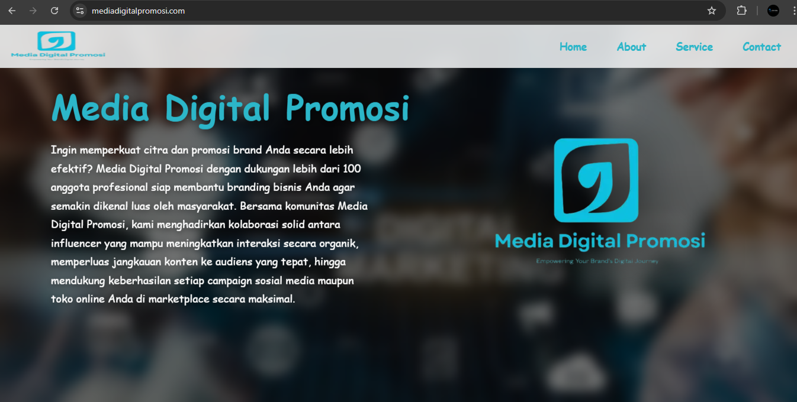
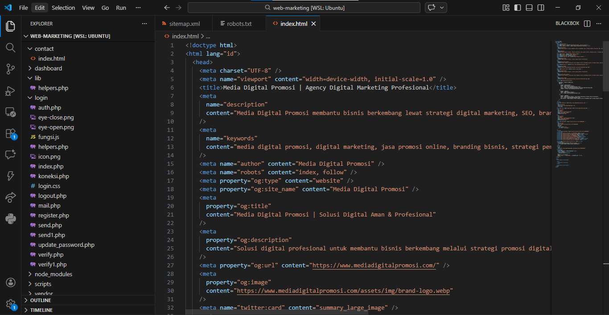

# 🚀 Portfolio Website — Media Digital Promosi

> README ini dibuat untuk kebutuhan **portfolio komersial** (project yang saya bangun untuk dijual kembali ke client).

Website ini menampilkan profil layanan digital marketing, data partner, dan jalur kontak bisnis dengan dashboard admin untuk manajemen konten.

## 📬 Hubungi Developer

Untuk request **source code**, **kustomisasi fitur**, atau **kerja sama project**:

👉 Email: **[support@thehackingguard.my.id](mailto:support@thehackingguard.my.id)**

---

## 🌐 Demo Live

Klik di bawah ini untuk melihat web live:

👉 **[Lihat Web Live](https://www.mediadigitalpromosi.com/#site-footer)**

---

## 🔄 Alur Kerja Website

1. **Pengunjung masuk ke halaman Home**
   - Menampilkan hero section, branding, dan value utama bisnis.
2. **Data layanan ditarik dari API**
   - Front-end menampilkan daftar services & item services secara dinamis.
3. **Partner/logo ditampilkan dari data aktif**
   - Logo partner ditampilkan sesuai urutan dari dashboard.
4. **Pengunjung diarahkan ke section kontak/footer**
   - CTA mengarahkan user ke bagian footer untuk komunikasi bisnis.
5. **Admin mengelola konten dari dashboard**
   - CRUD layanan, item layanan, partner, dan data kontak tanpa edit file HTML manual.

---

## ✅ Task Implementasi yang Digunakan

- Landing page portfolio yang clean dan mobile-friendly.
- Integrasi API internal (`services`, `partners`, `contact`) untuk data dinamis.
- Dashboard admin untuk manajemen konten.
- SEO on-page (meta, Open Graph, canonical, schema JSON-LD).
- Optimasi performa (preload asset penting, `defer` script, pemisahan CSS critical/non-critical).
- Struktur deployment-friendly untuk VPS + Nginx + PHP.

---

## 🔐 Fitur Keamanan Tersedia

- Security headers: `X-Frame-Options`, `X-Content-Type-Options`, CSP, `Referrer-Policy`.
- HSTS otomatis saat trafik HTTPS.
- Session hardening: `HttpOnly`, `SameSite`, strict mode, periodik regenerate session ID.
- CSRF token verification untuk form penting.
- Validasi upload gambar berdasarkan MIME type, ukuran, dan ekstensi.
- Sanitasi nama file upload untuk mencegah path traversal / karakter berbahaya.
- Pembatasan method pada endpoint API (method guard).
- Query database dengan prepared statement (MySQLi) untuk mitigasi SQL Injection.

---

## 🧰 Hosting, Tech Stack & Versi

### Runtime Hosting (Production)

| Komponen | Versi / Info |
|---|---|
| Hosting | VPS |
| OS | Ubuntu 24 |
| Web Server | Nginx |
| PHP Runtime Hosting | PHP 5.3 |
| Node.js | 22 |

### Stack Aplikasi

| Komponen | Detail |
|---|---|
| Front-end | HTML, CSS, JavaScript |
| Back-end | PHP |
| Database | MySQL (MySQLi) |
| Mailer | PHPMailer |

### Requirement yang Tercatat di Repository

- `composer.json` saat ini mencantumkan requirement: **PHP ^8.5** dan **phpmailer/phpmailer ^7.0**.

---

## 🖼️ Preview Source Code

---

## 💼 Informasi Komersial & Kustomisasi

README ini adalah portfolio untuk project yang saya jual kembali ke client dan ini adalah hasil implementasinya.

Jika kamu ingin source code versi kustom atau mau ubah tampilan/fitur, langsung kontak developer:

📧 **[support@thehackingguard.my.id](mailto:support@thehackingguard.my.id)**

---

## 📌 Catatan

Dokumentasi ini ditulis untuk kebutuhan presentasi portfolio, penawaran, dan gambaran teknis singkat project.
